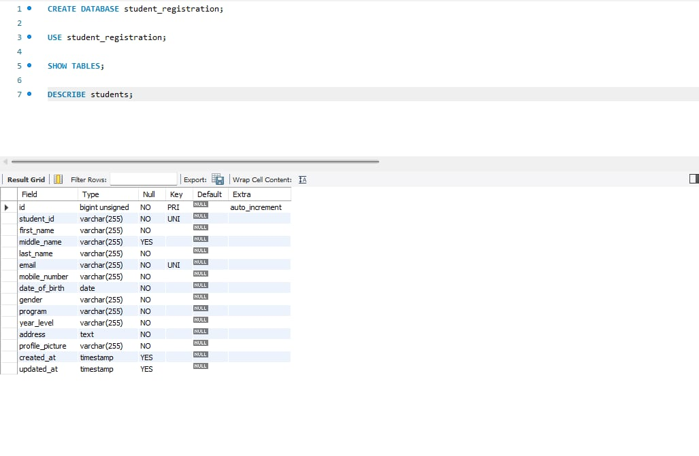
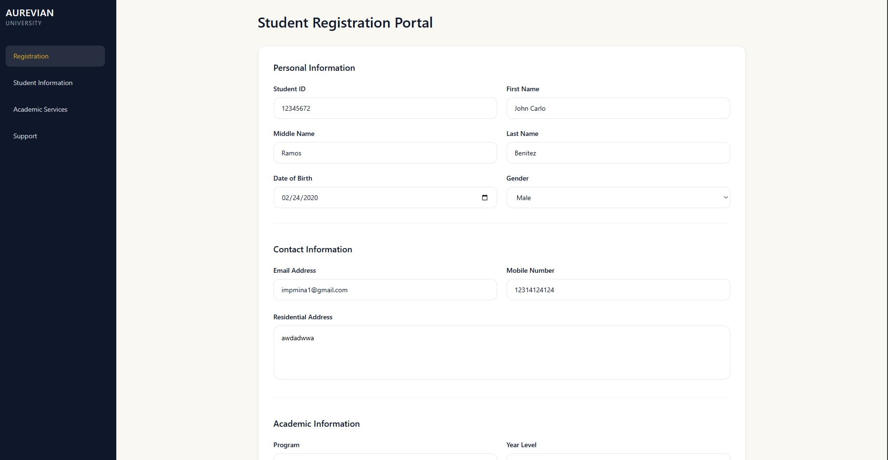
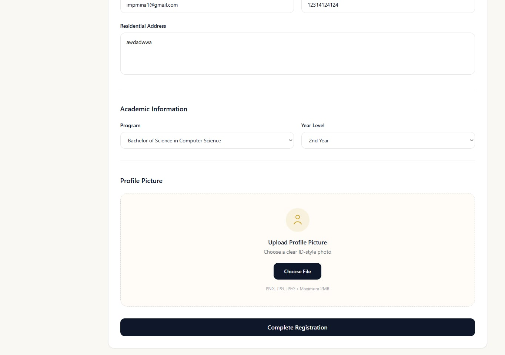
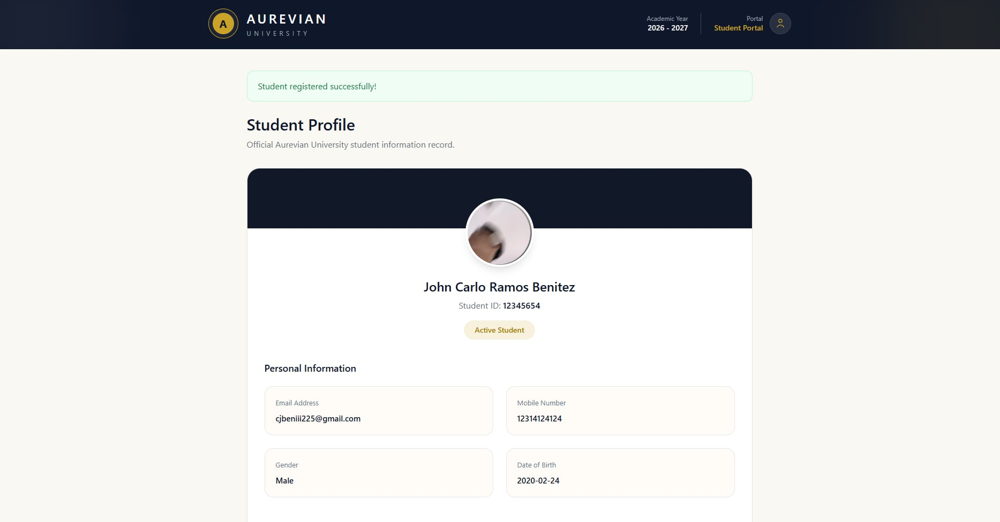
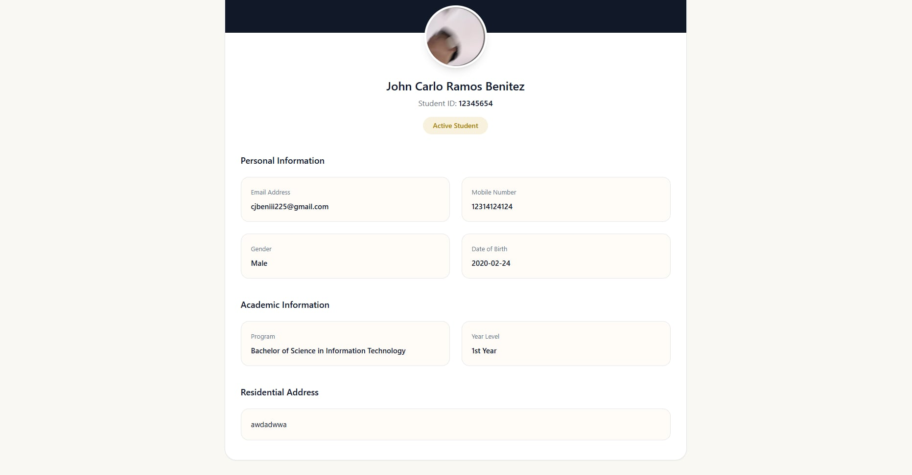

# Aurevian University Student Registration System

## Project Description

The Aurevian University Student Registration System is a web-based student registration application developed using Laravel.

The system allows students to submit their personal information, contact details, academic information, and profile picture through an online registration form. The submitted information is validated, stored in a MySQL database, and displayed through a student profile page after successful registration.

The purpose of this project is to provide a simple and organized digital solution for managing student registration records while applying proper validation, database management, and Laravel development practices.

---

# Features

## Student Registration Form

The system allows students to register their information including:

- Student ID
- First Name
- Middle Name
- Last Name
- Email Address
- Mobile Number
- Date of Birth
- Gender
- Program
- Year Level
- Address
- Profile Picture


## Input Validation

The system applies Laravel validation rules to ensure accurate and complete student information.

Validation includes:

- Required fields cannot be empty
- Student ID must be unique
- Student ID accepts numbers only
- Email address must follow a valid format
- Mobile number validation
- Profile picture file validation


## Profile Picture Upload

Students can upload their profile picture during registration.

Supported formats:

- JPG
- JPEG
- PNG

Maximum file size:

- 2MB


## Student Profile Display

After successful registration, the system displays the student's complete information:

- Student ID
- Full Name
- Email Address
- Mobile Number
- Date of Birth
- Gender
- Program
- Year Level
- Address
- Profile Picture


---

# Technologies Used

## Frontend

- HTML
- Tailwind CSS
- Laravel Blade Template


## Backend

- Laravel Framework
- PHP


## Database

- MySQL


---

# Database Structure

The system uses a MySQL database named:

```text
student_registration
```

The main table used in the system is:

```text
students
```

The `students` table stores student registration records including personal information, academic details, and uploaded profile pictures.


## Database Structure Screenshot




---

# Database Table Fields

The `students` table contains the following fields:

| Field Name | Description |
|---|---|
| id | Primary key |
| student_id | Unique student identification number |
| first_name | Student first name |
| middle_name | Student middle name |
| last_name | Student last name |
| email | Student email address |
| mobile_number | Student contact number |
| date_of_birth | Student birth date |
| gender | Student gender |
| program | Student academic program |
| year_level | Student current year level |
| address | Student residential address |
| profile_picture | Uploaded student image |
| created_at | Record creation date |
| updated_at | Record update date |


---

# System Flow

The system follows this process:

```
Student Registration Form

        ↓

Route Handling (web.php)

        ↓

StudentController

        ↓

Input Validation

        ↓

Student Model

        ↓

Save Data in MySQL Database

        ↓

Display Student Profile
```


---

# Laravel Project Structure

The following image shows the Laravel project structure of the Aurevian University Student Registration System.


---

# System Documentation

## Registration Flowchart

The registration flowchart shows how the system processes student registration from input submission, validation, database storage, and profile display.


## Database ER Diagram

The database ER diagram shows the structure of the students table and the relationship of stored student information.


## Laravel Request Lifecycle

The Laravel request lifecycle diagram shows how a request moves from the user interface, routes, controller, model, database, and Blade views.


---

# Installation Guide


## 1. Clone Repository

```bash
git clone <repository-url>
```


## 2. Install Dependencies

```bash
composer install
```


## 3. Setup Environment File

Create a copy of `.env.example`:

```bash
cp .env.example .env
```


Update your database configuration:

```env
DB_CONNECTION=mysql
DB_HOST=127.0.0.1
DB_PORT=3306
DB_DATABASE=student_registration
DB_USERNAME=root
DB_PASSWORD=
```


## 4. Generate Application Key

```bash
php artisan key:generate
```


## 5. Run Database Migration

```bash
php artisan migrate
```


## 6. Create Storage Link

For profile picture uploads:

```bash
php artisan storage:link
```


## 7. Run the Application

```bash
php artisan serve
```


Open in browser:

```text
http://127.0.0.1:8000
```


---

# Screenshots


## Student Registration Page







---

## Student Profile Page







---

# Testing

The system was tested using different scenarios.


## Valid Registration

Expected Result:

- Student information is saved successfully
- Profile picture is uploaded
- Student profile page is displayed


## Invalid Registration

Expected Result:

- Validation messages are displayed
- Data will not be saved until requirements are completed


---

# Problems Encountered


## 1. Database Table Error

### Problem:

The system displayed an error because the `students` table was not yet available in the database.

### Solution:

Created the migration file and executed:

```bash
php artisan migrate
```


---

## 2. Profile Picture Not Displaying

### Problem:

Uploaded images were successfully saved but were not displayed in the browser.

### Solution:

Created the Laravel storage link:

```bash
php artisan storage:link
```


---

## 3. Validation Issues

### Problem:

Some required fields were not properly validated during form submission.

### Solution:

Improved Laravel validation rules inside the `StudentController` to ensure correct user input handling.


---

# Reflection

Creating the Aurevian University Student Registration System gave me a better understanding of how important proper data handling is when developing a web application. At first, I thought that creating a registration system was mainly about designing a form and saving information in a database. However, while working on this project, I realized that a reliable system requires proper validation, organized data management, and secure handling of user inputs.

One of the most important lessons I learned from this project is the importance of input validation. Ensuring that users provide complete and correct information helps prevent errors and keeps the database organized. Features such as required fields, unique student ID validation, email checking, and image validation showed me that a system should not only collect data but also verify if the information is reliable.

I also learned more about handling uploaded files, especially profile pictures. I discovered that file uploads require proper checking and storage management because accepting incorrect files may cause problems in the system.

During the development process, I encountered different challenges such as database migration errors, missing tables, and issues with displaying uploaded images. Solving these problems helped me understand how Laravel components work together, including routes, controllers, models, views, and database connections.

Overall, this project improved my understanding of Laravel development and database management. It taught me that creating a system is not only about making features work but also about building something organized, secure, and user-friendly.


---

# References

- Laravel Documentation  
https://laravel.com/docs

- PHP Documentation  
https://www.php.net/docs.php

- MySQL Documentation  
https://dev.mysql.com/doc/

- Tailwind CSS Documentation  
https://tailwindcss.com/docs


---

# Author

Developed by:

**John Carlo R. Benitez**

Aurevian University Student Registration System

2026