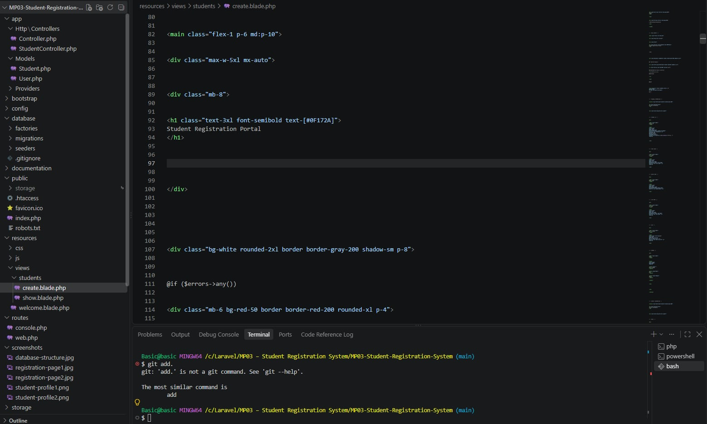

# Aurevian University Student Registration System

## Project Description

The Aurevian University Student Registration System is a web-based student registration application developed using Laravel.

The system allows students to submit their personal information, contact details, academic information, and profile picture through an online registration form. The submitted information is validated, stored in a MySQL database, and displayed through a student profile page after successful registration.

The purpose of this project is to provide a simple and organized digital solution for managing student registration records while applying proper validation, database management, file handling, and Laravel development practices.

---

# Features

## Student Registration Form

The system allows students to register their information including:

- Student ID
- First Name
- Middle Name
- Last Name
- Email Address
- Mobile Number
- Date of Birth
- Gender
- Program
- Year Level
- Address
- Profile Picture

## Input Validation

The system applies Laravel validation rules to ensure that the submitted student information is complete and valid.

Validation includes:

- Required fields cannot be empty
- Student ID must be unique
- Student ID accepts numbers only
- Email address must follow a valid format
- Mobile number validation
- Date of birth validation
- Program and year level are required
- Profile picture must be a valid image
- Profile picture must not exceed the allowed file size

## Profile Picture Upload

Students can upload their profile picture during registration.

Supported formats:

- JPG
- JPEG
- PNG

Maximum file size:

- 2MB

## Student Profile Display

After successful registration, the system displays the student's information including:

- Student ID
- Full Name
- Email Address
- Mobile Number
- Date of Birth
- Gender
- Program
- Year Level
- Address
- Profile Picture

## Success and Error Messages

The system provides feedback after form submission.

For successful registration:

- A success message is displayed
- Student information is saved
- The uploaded profile picture is stored
- The student profile page is displayed

For invalid registration:

- Validation errors are displayed
- The submitted information is not saved until the requirements are satisfied

---

# Technologies Used

## Frontend

- HTML
- Tailwind CSS
- Laravel Blade Templates

## Backend

- Laravel Framework
- PHP

## Database

- MySQL

---

# Database Structure

The system uses a MySQL database named:

```text
student_registration
```

The main table used in the system is:

```text
students
```

The `students` table stores student registration records including personal information, academic details, contact information, and uploaded profile pictures.

## Database Structure Screenshot


---

# Database Table Fields

The `students` table contains the following fields:

| Field Name | Description |
|---|---|
| id | Primary key |
| student_id | Unique student identification number |
| first_name | Student first name |
| middle_name | Student middle name |
| last_name | Student last name |
| email | Student email address |
| mobile_number | Student contact number |
| date_of_birth | Student birth date |
| gender | Student gender |
| program | Student academic program |
| year_level | Student current year level |
| address | Student residential address |
| profile_picture | Uploaded student image |
| created_at | Record creation date |
| updated_at | Record update date |

---

# System Flow

The system follows this process:

```text
Student Registration Form
          ↓
Route Handling (web.php)
          ↓
StudentController
          ↓
Input Validation
          ↓
Student Model
          ↓
Save Data in MySQL Database
          ↓
Display Student Profile
```

---

# Laravel Project Structure

The following screenshot shows the Laravel project structure of the Aurevian University Student Registration System.



---

# System Documentation

## Registration Flowchart

The registration flowchart shows how the system processes a student's registration from form submission and validation to database storage and profile display.

> **Note:** Export the Draw.io diagram as a PNG file before using it in the README.


---

## Database ER Diagram

The database ER diagram shows the structure of the `students` table and the information stored for each registered student.


---

## Laravel Request Lifecycle

The Laravel Request Lifecycle diagram shows how a request moves through the application's routes, controller, validation, model, database, and Blade views.


---

# Installation Guide

## 1. Clone Repository

```bash
git clone <repository-url>
```

## 2. Install Dependencies

```bash
composer install
```

## 3. Setup Environment File

Create a copy of `.env.example`:

```bash
cp .env.example .env
```

Update the database configuration:

```env
DB_CONNECTION=mysql
DB_HOST=127.0.0.1
DB_PORT=3306
DB_DATABASE=student_registration
DB_USERNAME=root
DB_PASSWORD=
```

## 4. Generate Application Key

```bash
php artisan key:generate
```

## 5. Run Database Migration

```bash
php artisan migrate
```

## 6. Create Storage Link

The storage link allows uploaded profile pictures to be accessed by the application.

```bash
php artisan storage:link
```

## 7. Run the Application

```bash
php artisan serve
```

Open the application in your browser:

http://127.0.0.1:8000

---

# Screenshots

This section shows the actual testing and output of the Aurevian University Student Registration System.

## 1. Student Registration Page

The registration page allows students to enter their personal, contact, and academic information.


---

## 2. Validation Errors

The system displays validation messages when required information is missing or when invalid data is entered.


---

## 3. Flash Success Message

After successful registration, the system displays a confirmation message to inform the user that the student record was successfully created.


---

## 4. Browser Output

The browser output shows the working result of the student registration system after running the Laravel application.


---

## 5. Student Profile

After registration, the system displays the student's profile containing the submitted information and uploaded profile picture.


---

## 6. Database Records

The database records screenshot shows the student information stored in the MySQL `students` table.


---

## 7. Database Structure

The following screenshot shows the structure of the database table used by the system.


---

## 8. Laravel Project Structure

The following screenshot shows the Laravel files and folders used to develop the system.


---

## 9. Terminal Output

The terminal output shows the Laravel commands used while setting up and running the application.


---

# Testing

The system was tested using different scenarios to verify that the registration process, validation, file upload, database storage, and profile display work correctly.

## Test Case 1: Valid Registration

### Test

A student enters complete and valid information and uploads a valid profile picture.

### Expected Result

- Student information is saved successfully
- Profile picture is uploaded
- Data is stored in the MySQL database
- Success message is displayed
- Student profile page is displayed

### Result

**Passed**

---

## Test Case 2: Required Field Validation

### Test

The registration form is submitted without completing the required fields.

### Expected Result

- Validation messages are displayed
- The form is not successfully submitted
- Student data is not saved

### Result

**Passed**


---

## Test Case 3: Unique Student ID

### Test

A student ID that already exists in the database is submitted.

### Expected Result

- Laravel validation detects the duplicate student ID
- Registration is rejected
- Existing records are not overwritten

### Result

**Passed**

---

## Test Case 4: Profile Picture Upload

### Test

A valid JPG, JPEG, or PNG profile picture within the allowed file size is uploaded.

### Expected Result

- Image passes validation
- Image is stored successfully
- Image is displayed on the student profile

### Result

**Passed**

---

## Test Case 5: Database Storage

### Test

A valid registration is submitted.

### Expected Result

- Student information is stored in the `students` table
- The registered record can be viewed in the database

### Result

**Passed**


---

# Problems Encountered

## 1. Database Table Error

### Problem

The system displayed an error because the `students` table was not yet available in the database.

### Solution

The migration was created and executed using:

```bash
php artisan migrate
```

---

## 2. Profile Picture Not Displaying

### Problem

Uploaded images were successfully stored but were not initially displayed in the browser.

### Solution

The Laravel storage link was created using:

```bash
php artisan storage:link
```

---

## 3. Validation Issues

### Problem

Some required fields were not properly validated during form submission.

### Solution

The validation rules inside the `StudentController` were improved to properly check the submitted information.

---

## 4. Formatting and User Interface Issues

### Problem

Some parts of the registration form initially had inconsistent spacing, sizing, and alignment.

### Solution

The Blade view was revised using Tailwind CSS and custom CSS classes to improve the layout, spacing, input fields, sections, and overall appearance.

---

# Reflection

Creating the Aurevian University Student Registration System gave me a better understanding of how important proper data handling is when developing a web application.

At first, I thought that creating a registration system was mainly about designing a form and saving the information in a database. However, while working on the project, I realized that there are several important processes involved, especially when it comes to validation, database storage, and handling uploaded files.

One of the most important things I learned was the importance of input validation. Making sure that users provide complete and correct information helps prevent errors and keeps the database organized. Features such as required fields, unique student ID validation, email checking, and image validation helped me understand how Laravel can be used to control the information submitted by users.

I also learned more about handling profile picture uploads. I learned that uploaded files need to be validated and stored properly so they can be safely accessed and displayed by the application.

During development, I encountered different problems such as database migration errors, missing tables, validation issues, and problems with displaying uploaded images. Solving these problems helped me understand how Laravel components work together, including routes, controllers, models, views, storage, and database connections.

Overall, this project improved my understanding of Laravel development and MySQL database management. It also helped me improve my debugging skills and gave me more confidence in creating web applications that are organized, functional, and easier for users to interact with.

---

# References

- Laravel Documentation  
  https://laravel.com/docs

- PHP Documentation  
  https://www.php.net/docs.php

- MySQL Documentation  
  https://dev.mysql.com/doc/

- Tailwind CSS Documentation  
  https://tailwindcss.com/docs

---

# Author

Developed by:

**John Carlo R. Benitez**

Aurevian University Student Registration System

2026